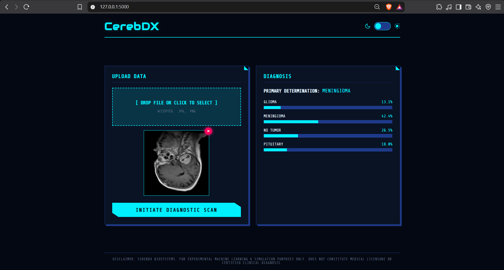

## CerebDX

CerebDX is a full-stack AI web application designed for processing and classifying medical brain scan images through a real-time neural network inference pipeline.
IDK i just wanted to make a Cyberpunk theme interface so i made this thing



## About the Project

CerebDX bridges the gap between AI and intuitive web interfaces. Featuring a custom cyberpunk-inspired diagnostic console, the application allows users to upload medical images, preview target scans instantly, and stream neural inference probabilities in real time.

## Tech Stack

* Frontend: HTML5, CSS3 with custom theme switching, JavaScript (ES6+)
* Backend: Python, Flask REST API
* Artificial Intelligence: PyTorch, Torchvision using pre-trained ResNet18 architecture
* Image Processing: Pillow (PIL)

## Project Structure

```text
CerebDX/
├── static/
│   └── uploads/       # Directory for user-uploaded scan images
├── templates/
│   └── index.html     # Frontend user interface template
├── app.py             # Flask backend server and PyTorch inference engine
└── README.md          # Project documentation
```

Installation and Quick Start
Follow these instructions to run CerebDX locally on your machine:

##1. Clone the Repository
git clone [https://github.com/YOUR_USERNAME/CerebDX.git](https://github.com/abinasz/CerebDX.git)

##2. Install Dependencies
Ensure Python is installed, then install the required Python packages:
pip install flask torch torchvision pillow

##3. Run the Application
Start the Flask development server:
python app.py

##4. Access the Web Application
Open a web browser and navigate to the local address:
[http://127.0.0.1:5000](http://127.0.0.1:5000)

that's it folks but remember this is an AI sytems project not a ML project.

#Disclaimer
CerebDX Biosystems. For experimental machine learning and simulation purposes only. Does not constitute medical licensure or certified clinical diagnosis._
